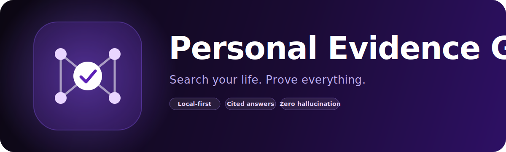

<p align="center">
  
</p>

<p align="center">
  <a href="https://github.com/SativusCrocus/Personal-Evidence-Graph"></a>
  
  
</p>

<p align="center">
  
  
  
  
  
  
  
  
  
</p>

<p align="center">
  <b>Search your life. Prove everything.</b><br/>
  A local-first, proof-aware memory system for your personal evidence —
  PDFs, images, audio, and text. Ask anything in plain English; every answer
  cites the exact file, page, timestamp, and excerpt — or refuses.
</p>

<p align="center">
  <a href="https://frontend-eight-pearl-52.vercel.app">Live frontend preview</a> ·
  <a href="docs/architecture.md">Architecture</a> ·
  <a href="docs/citation-contract.md">Citation contract</a> ·
  <a href="docs/api.md">API</a> ·
  <a href="docs/security.md">Security</a>
</p>

---

## About

**Personal Evidence Graph (PEG)** is a private knowledge engine that turns the
unstructured pile of files on your machine — receipts, contracts, screenshots,
voice memos, scanned letters, exported chat logs — into a queryable graph of
*citable evidence*. It runs entirely on your own hardware, indexes everything
you point it at, and answers natural-language questions with verbatim excerpts
from the source material. No cloud, no telemetry, no training on your data.

It exists because the current generation of "ask your documents" tools all share
the same failure mode: they confidently fabricate. Generic chatbots invent
sources. RAG demos cite by file name and stop there. PEG enforces a stricter
contract — a claim is only allowed to appear in an answer if a verbatim excerpt
of it was actually returned by the retriever for this exact question. If
nothing matches, the answer is exactly **`"No supporting evidence found."`** and
nothing else.

That contract is the product. It is enforced in
[`backend/app/services/answer.py`](backend/app/services/answer.py),
formalized in [`docs/citation-contract.md`](docs/citation-contract.md), and
guarded by [`tests/unit/test_citation_validator.py`](tests/unit/test_citation_validator.py)
and [`tests/integration/test_no_hallucination.py`](tests/integration/test_no_hallucination.py).

## Description

PEG is a self-hosted monorepo with three pieces working together:

| Layer | What it does |
|---|---|
| **Ingestion pipeline** | Watches folders, deduplicates by SHA-256, extracts text from PDFs (with OCR fallback), images (Tesseract), audio (whisper.cpp), and plain text. Chunks, embeds, and writes to both Chroma and SQLite-FTS5 in lockstep. |
| **FastAPI backend** | Hybrid retrieval (vector + BM25), reranking, citation-validated answer synthesis via local Ollama models, plus timeline reconstruction across every source. |
| **Next.js 15 frontend** | Dark-first UI with a `⌘K` command palette. Drag-and-drop import, evidence viewer with PDF.js highlighting, click-through citations, and a chronological timeline of every event PEG has ever seen. |

Everything is offline by default. The only external dependency at runtime is
the model server (Ollama), which also runs locally.

## Highlights

- **Zero hallucination by construction.** Every claim must map to a returned chunk; otherwise the system refuses with the exact string above.
- **Hybrid retrieval.** Vector similarity from `bge-small-en-v1.5` plus BM25 from SQLite-FTS5, reranked together.
- **Multi-modal ingestion.** PDFs (with OCR fallback), images (Tesseract OCR), audio (whisper.cpp), text — all chunked and indexed identically.
- **Click-to-source.** Every citation jumps to the original file with the matching page, timestamp, or region highlighted.
- **Chronological timeline.** Reconstruct what happened on any date across every source you've ever ingested.
- **Idempotent.** SHA-based dedup means re-ingesting the same folder does nothing.
- **Path-traversal hardened.** `EVG_WATCHED_ROOTS` is a strict allowlist; everything outside is rejected.
- **Single-machine first.** SQLite + Chroma + Ollama. No services to operate.

## Stack

| Layer | Choice | Why |
|---|---|---|
| Frontend | **Next.js 15 + TypeScript + Tailwind + shadcn-style + Framer Motion + cmdk** | Fast, modern, dark-first, command-palette-driven |
| Backend  | **Python FastAPI** | Async, typed, batteries for SSE & background tasks |
| Vector store | **Chroma** (persistent) | Easy metadata filtering, zero-ops |
| Relational store | **SQLite + FTS5** | Single-file, BM25 for hybrid search |
| Embeddings | **sentence-transformers / `bge-small-en-v1.5`** | 384-dim, fast, accurate |
| LLM | **Ollama** (`llama3.1`, `mistral`, `gemma2:2b` for low-RAM) | Local, swappable |
| OCR | **Tesseract** (PaddleOCR fallback later) | Battle-tested |
| ASR | **whisper.cpp** (OpenAI whisper fallback) | Local transcription |
| Watcher | **watchdog** | Auto-ingest dropped folders |

## Install

### macOS

```bash
git clone https://github.com/SativusCrocus/Personal-Evidence-Graph.git
cd Personal-Evidence-Graph
./scripts/install_mac.sh
./scripts/pull_models.sh
./scripts/dev.sh
```

Open **http://localhost:3000**. The API is on **http://localhost:8000** with
docs at `/docs`.

### Linux

```bash
./scripts/install_linux.sh
./scripts/pull_models.sh
./scripts/dev.sh
```

### Windows (PowerShell, elevated)

```powershell
.\scripts\install_windows.ps1
ollama pull llama3.1:8b
.\.venv\Scripts\Activate.ps1
# in one terminal:
cd backend; uvicorn app.main:app --port 8000 --reload
# in another:
cd frontend; npm run dev
```

### Manual prerequisites (any platform)

Install these system tools on PATH:

- Python 3.11+
- Node 20+
- [Ollama](https://ollama.com)
- Tesseract OCR
- FFmpeg (for whisper)
- libmagic (`brew install libmagic` / `apt install libmagic1`)
- Optional: `whisper.cpp` (`main` binary on PATH) for fast transcription, or `pip install openai-whisper`

Then:

```bash
python -m venv .venv && source .venv/bin/activate
pip install -e backend
pip install -e "backend[dev]"
cd frontend && npm install && cd ..
cp .env.example .env   # review EVG_WATCHED_ROOTS!
```

## Usage

1. **Import** — open http://localhost:3000/import. Drag & drop files (PDFs, images, audio, text). Or set `EVG_WATCHED_ROOTS` and use the folder ingest box.
2. **Dashboard** — see counts, recent timeline, system health.
3. **Ask** — `⌘K` opens the command palette. Type a question and press Enter. The answer panel shows the response on the left and citations on the right.
4. **Click a citation** — opens `/evidence/{id}` with the chunk on the left and the original file rendered on the right (PDF.js / image / audio with timestamp jump).
5. **Timeline** — chronological reconstruction across every source, filterable by date and keyword.
6. **Settings** — model picker, storage stats, "Rebuild index".

## Configuration (.env)

See [`.env.example`](.env.example) for the full list with defaults. The most
important ones:

- `EVG_DATA_DIR` — where everything lives. Defaults to `./data`.
- `EVG_WATCHED_ROOTS` — comma-separated absolute paths the user has authorized for `/ingest/folder`. Anything outside these is rejected.
- `EVG_LLM_MODEL` — Ollama model tag. Default `llama3.1:8b`.
- `EVG_LLM_FALLBACK_MODEL` — used in low-RAM mode. Default `gemma2:2b`.
- `EVG_RETRIEVAL_MIN_SCORE` — semantic similarity floor. Below this, the system refuses rather than calls the LLM. Default `0.35`.

## Tests

```bash
source .venv/bin/activate
pytest tests
```

Notable suites:

- [`tests/integration/test_no_hallucination.py`](tests/integration/test_no_hallucination.py) — the core invariant. Empty DB → refusal. Unreachable LLM → refusal.
- [`tests/unit/test_citation_validator.py`](tests/unit/test_citation_validator.py) — exhaustive tests of `_validate()`.
- [`tests/unit/test_paths_security.py`](tests/unit/test_paths_security.py) — path-traversal guard.
- [`tests/unit/test_dedup.py`](tests/unit/test_dedup.py) — SHA-based deduplication end-to-end.
- [`tests/integration/test_ingest_text.py`](tests/integration/test_ingest_text.py) — text ingestion writes both SQLite and Chroma in lockstep.
- [`tests/integration/test_api_endpoints.py`](tests/integration/test_api_endpoints.py) — health, ingest, query, security headers.
- [`tests/integration/test_search_accuracy.py`](tests/integration/test_search_accuracy.py) — hybrid retrieval finds the known phrase.

Tests use a per-session temp dir (see [`tests/conftest.py`](tests/conftest.py))
so they never touch your real evidence DB.

## Verification (acceptance test for the MVP)

1. `./scripts/dev.sh` — backend on `:8000`, frontend on `:3000`.
2. `curl http://localhost:8000/health` returns `{"ok": true, "db": true, "chroma": true, "ollama": true}`.
3. Open `/import`, drop a sample PDF or text file. Within seconds it appears in the list with status `indexed` and a chunk count > 0.
4. On `/search`, ask a question whose answer is in the file. Response renders with ≥ 1 citation card. Click → `/evidence/[id]` opens with the highlight.
5. On `/search`, ask something completely unrelated. Response is exactly `"No supporting evidence found."` with zero citations. (Asserted by `test_no_hallucination.py`.)
6. Visit `/timeline` — events from your file appear sorted by date.
7. `pytest tests` — all green.

## Documentation

- [`docs/architecture.md`](docs/architecture.md) — system overview, request flows, module map.
- [`docs/citation-contract.md`](docs/citation-contract.md) — the no-hallucination invariant, formalized.
- [`docs/ingestion-pipeline.md`](docs/ingestion-pipeline.md) — extractors, chunking, persistence, idempotency.
- [`docs/security.md`](docs/security.md) — threat model, defenses, roadmap.
- [`docs/api.md`](docs/api.md) — every endpoint with example payloads.

## Folder layout

```
personal-evidence-graph/
├── frontend/      Next.js 15 app (pages, components, api client)
├── backend/       FastAPI app (routers, services, security, models)
├── ai/            chunking, embeddings, LLM client, prompt templates
├── ingestion/     extractors, hashing, metadata, watchdog
├── db/            schema.sql, migrations
├── scripts/       install_*.sh, pull_models.sh, dev.sh, reset_db.sh
├── tests/         unit + integration
├── docs/          architecture, citation contract, ingestion, security, api
├── docker/        optional postgres compose for v1.x
├── installers/    placeholder for Tauri (post-MVP)
├── .env.example
└── README.md
```

## Deployment

The Next.js frontend deploys cleanly to **Vercel** out of the box (set
`Root Directory` to `frontend/`). The current preview is at
**https://frontend-eight-pearl-52.vercel.app**.

The FastAPI backend is intentionally local-only — your evidence never leaves
your machine. To use the deployed frontend against your own data, run the
backend locally and point `NEXT_PUBLIC_API_BASE_URL` at it via a tunnel
(Tailscale, Cloudflare Tunnel, ngrok), or self-host the whole stack with the
included Docker compose under [`docker/`](docker/).

## Launch checklist

- [ ] System deps installed (`tesseract`, `ffmpeg`, `libmagic`, `ollama`).
- [ ] `scripts/install_<platform>.sh` succeeds on a fresh machine.
- [ ] `scripts/pull_models.sh` pulls the chosen Ollama model and warms embeddings.
- [ ] `scripts/dev.sh` starts both processes; `/health` is `ok: true` everywhere.
- [ ] At least one of each source type ingests cleanly (PDF, image, audio, text).
- [ ] A real question answers with valid citations.
- [ ] An unrelated question refuses with the exact refusal string.
- [ ] `pytest tests` passes.
- [ ] `EVG_WATCHED_ROOTS` is set to whatever folders you actually want auto-ingested.
- [ ] `.env` is **not** committed (covered by `.gitignore`).
- [ ] `data/` is **not** committed.

## Roadmap (post-MVP, v1.1+)

Captured in the plan; tracked here so expectations are clear:

- Contradiction Engine (changed numbers, conflicting promises)
- Obligation Engine (deadlines, unpaid invoices, follow-ups)
- Tauri desktop packaging + signed installers
- Browser extension capture + screenshot hotkey
- Voice-memo instant ingest from menubar
- Invoice fraud detection
- Memory heatmap
- At-rest DB encryption (sqlcipher)
- Encrypted-sync team tier
- Multi-user roles, signed sessions, CSRF

These are well-defined enough to slot into a v1.1 plan once the MVP is validated end-to-end.

## License

Proprietary. All rights reserved.

<p align="center">
  
</p>
<p align="center"><sub>Built for the people who'd rather <b>prove it</b> than ask you to trust them.</sub></p>
